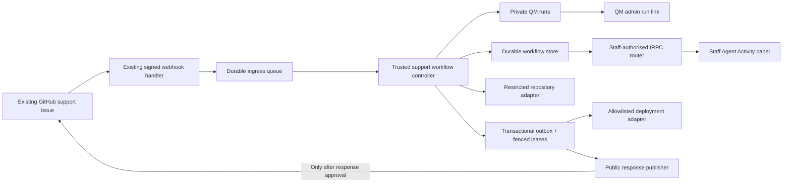

# QM support workflow

This is an additive, removable support experiment. Existing customer support remains
the system of record; QM runs private agent stages behind it. Nothing in this repository
pushes a branch, opens a pull request, deploys, or comments on a customer issue during
the local demos.

The complete local workflow implementation is in `packages/support-workflow/`. The
editable QM v0.1.4 source is in `experimental/qm/`, and its organization-owned
deployment layer is in `infra/qm/`.

## Architecture



The controller, not the model, owns workflow state, idempotency, approvals, retries,
leases, SHA binding, restricted-path checks, deployment dispatch, and public
publication. QM returns a structured artifact; trusted code decides what may happen
next. Human approvals, their state transitions, audit activity, artifacts, and
outbox intents are committed atomically.

## Where the agent comments and code suggestions appear

Agent work is never posted as a GitHub issue comment by default.

| Surface | What it contains | Audience |
| --- | --- | --- |
| GitHub support issue | Customer messages and, eventually, one approved public response | Customer and existing issue viewers |
| Staff Agent Activity panel | Curated stage status, evidence, tests, changed paths, restricted proposals, approvals, and safe links | Staff-only application route |
| QM admin link | The private QM run for deeper inspection | QM operators/staff with QM access |
| Candidate workspace or draft PR | The proposed code diff, only when a trusted repository capability permits publication | Engineering reviewers |

The staff API deliberately returns a curated browser model. It does not return raw
prompts, chain-of-thought, credentials, full QM transcripts, or customer-invisible
material through the customer support procedure. The only public transition is
`approve_response`, which calls the injected idempotent response publisher.

## Workflow and gates

1. **Intake:** the existing webhook verifies the GitHub signature and validates the
   event shape. It acknowledges only after durable enqueue succeeds; queue failures
   return a retryable response.
2. **Validate agent:** checks completeness, reproduction, duplicate/sensitive content,
   prompt injection, P0, and security signals. It cannot change code.
3. **Triage agent:** assigns route, priority, component, confidence, and risk. R0 can
   route straight to a response draft; code work proceeds to investigation.
4. **Investigation agent:** works read-only at the exact base SHA, reproduces the issue,
   follows existing sibling patterns, and proposes exact files and tests.
5. **Human plan gate:** no implementation begins until the current issue snapshot and
   plan artifact are approved. R3 or restricted work becomes proposal-only.
6. **Implementation agent:** works in an isolated candidate workspace on allowlisted
   source and test paths. A draft PR is optional and requires an explicit trusted
   repository capability; local mode leaves the candidate local.
7. **Independent QC agent:** inspects the exact candidate SHA in a fresh context. A
   trusted diff, not the agent's claimed file list, enforces repository policy. Two
   failed QC loops stop for a human.
8. **Human code review:** a reviewer can request changes or record the reviewed merge
   SHA. The controller will not skip from QC to deployment.
9. **Staging verification agent:** confirms the exact merged SHA and repeats the
   original scenario with non-destructive checks.
10. **Human deployment gate:** approval is bound to the current issue, artifact, and
    immutable SHA.
11. **Deployment intent agent and trusted adapter:** QM validates the bounded intent but
    receives no deployment authority. A passing result atomically creates a durable
    outbox intent. A fenced worker invokes the configured adapter with one stable
    idempotency key and rejects a receipt for any other SHA.
12. **Production verification agent:** independently confirms the exact deployed SHA,
    health, and original scenario without modifying production data.
13. **Response agent and human response gate:** QM drafts a customer-safe response. A
    human approval and publication intent are stored in one transaction before a
    fenced worker can create the GitHub comment.

Every QM stage uses a private conversation reference and a persisted delivery/stage
idempotency key. Agent-stage leases can be reclaimed after a process crash without
creating a new logical attempt. New issue content makes ordinary in-flight work and
approvals stale; an already-attempted deployment/publication fences ingress until the
same idempotency key is reconciled. Malformed QM output, invalid stage decisions,
oversized unscreenable input, approval requests, silent runs, unexpected SHAs, and
request/run timeouts fail closed.

## Rollout ceiling

Every server-owned route has an `automationMode`; the state machine enforces it even if
an agent asks to continue.

| Mode | Maximum behaviour | External effect |
| --- | --- | --- |
| `shadow` | Validate and triage, then finish as `shadow_complete` | None |
| `plan` | Investigate and show a plan for review | None |
| `code` | Produce a candidate and run independent QC | Local candidate; writable QM execution remains disabled until an isolated repository capability is explicitly configured |
| `release` | Merge record, staging checks, trusted deployment, production checks, and response draft | Deployment only after human approval; no customer message |
| `full` | Complete workflow including approved response | Approved customer response |

Start every target repository in `shadow`. Advance one repository at a time after its
false-positive rate, routing, evidence quality, and staff experience are acceptable.
Dropping a route back to `shadow`, or not registering the workflow webhook consumer at
all, leaves ordinary support behaviour in place.

## Repository safety policy

The route resolver supplies the target repository, base branch, allowed and forbidden
path globs, approved test commands, environments, and deployment adapter. The trusted
diff policy blocks and converts to R3 proposal-only when it sees:

- database schemas, migrations, or database operations;
- dependency manifests, lockfiles, or added dependencies;
- CI/workflow, infrastructure, authentication/authorization, secrets, release,
  generated, forbidden, or non-allowlisted files;
- suspicious database/package changes found in patch metadata even when the agent
  omits them from its response.

These restrictions apply to target-product changes. The integration itself adds the
new support workflow package and the pinned QM source/deployment directories, but an
agent handling a customer issue cannot change those categories in a target repository.

## What is implemented here

- versioned Zod contracts for workflow records, artifacts, approvals, activity, routes,
  visibility, risk, and agent output;
- an explicit state machine with human gates and rollout ceilings;
- transactional ingress idempotency, atomic approval/state/audit commits, fenced
  deployment/response outboxes, reclaimable stage leases, retry limits, stale
  invalidation, QC loop limits, and P0/security escalation;
- a QM v0.1.4 HTTP client with the upstream HMAC source-auth contract, async run polling,
  timeouts, and fail-closed run handling;
- nine validated QM sandbox skills, one for each agent stage;
- an explicit repository workspace prepare/release lifecycle, trusted full-diff
  enforcement, structured human feedback, and exact candidate/merged/deployed SHA checks;
- a trusted deployment port and idempotent public response port;
- a staff-only tRPC router and curated `AgentActivityPanel` UI;
- signed webhook-to-queue integration, GitHub App-safe sender handling, label/lifecycle
  invalidation, one durable dispatcher per delivery, and malformed-payload handling;
- stage-scoped QM read-only turns, explicit writable-stage opt-in, bounded HTTP requests,
  safe HTTP(S) links, and the local QM `requireSecurityScreen` core extension;
- in-memory adapters and scenarios for side-effect-free local testing.

The production storage, queue, repository workspace, deployment, and response adapters
remain injected ports because this repository is a reusable support package, not the
consuming backend. That preserves the current infrastructure rather than introducing a
second server, database, or queue here.

## Production integration into the existing backend

The consuming support backend should compose the package at its current boundaries:

1. Keep the existing `createIssueWebhookHandler` route and pass its normalized events to
   `createSupportWorkflowWebhookEnqueuer` through `onEvent`.
2. Implement `WorkflowQueue` with the existing durable job system. The HTTP request must
   never wait for QM.
3. Implement `WorkflowStore` with the backend's existing durable store. Its `transact`
   operation must atomically check the workflow version and ingress key, then write the
   workflow, approvals, feedback, artifacts, activities, and outbox records. Do not
   implement these as independent writes or substitute an in-process map in production.
4. Resolve a server-owned `SupportRoute` for each support repository. Begin with
   `automationMode: "shadow"` and a narrow path allowlist.
5. Implement `RepositoryPort` with prepare/release operations for isolated, immutable
   read-only checkouts and disposable candidate-write workspaces, a trusted full-diff
   inspection, and a merge check that binds the recorded merge SHA to the reviewed
   candidate SHA. Do not give a general GitHub token to every QM stage. Grant optional
   draft-PR publication separately.
6. Build `createQmClient` with the private QM core URL and signing secret on the server,
   then wrap it with `createQmAgentRuntime`. Leave `writableStages` empty for shadow and
   plan rollout; opt `implement` in only after the isolated workspace is proven.
7. Implement `DeploymentPort` as a fixed map of adapter IDs to existing deployment
   commands/workflows. Ignore model-proposed commands and accept only the route's exact
   SHA and environment.
8. Implement `PublicResponsePublisher` with the existing GitHub App client. Its
   idempotency key must make retries return the original comment rather than post twice.
9. Mount `createSupportWorkflowRouter` with a genuinely staff/admin-authorised tRPC
   procedure, never the customer support procedure. Its required action-authorizer
   callback must apply existing role checks so only approved staff can plan, merge,
   deploy, or publish.
10. Run queue workers outside the webhook request, call `ingest`, then `runUntilGate`,
    and wake the same workflow after a staff action or relevant issue update. Treat
    retryable ingress conflicts as queue retries. The production store/adapters must
    preserve outbox idempotency and fencing behavior.

No production adapter should be introduced until its existing infrastructure owner,
authentication boundary, idempotency behaviour, timeout, and rollback are explicit.

## Local test lanes

### 1. Controller and policy simulation

The normal local entry point starts the editable QM core, in-memory workflow API,
and staff UI under Bun:

```bash
bun run dev
```

Open <http://127.0.0.1:4174>. Default mock mode is still an actual QM process:
requests cross signed source authentication, required inbound screening, async
run execution, artifact validation, the controller, and human gates. The mock
harness returns deterministic artifacts and the repository/deploy/response
adapters are local recorders, so there are no external effects.
On a clean checkout the launcher installs missing locked dependencies for
Support, the vendored QM source, and the staff UI; later runs skip that work.

Use `SUPPORT_QM_PORT` and `SUPPORT_WORKFLOW_DEMO_PORT` to change the two localhost
ports. `bun run dev:qm` starts only QM; `bun run dev:ui` starts the UI with its
clearly labelled scripted fallback.

The fastest non-server checks remain:

```bash
bun run check
bun run test
bun run demo:workflow --scenario=happy
```

Available scenarios are `happy`, `shadow`, `answer`, `restricted`, `p0`, `qc-fail`, and
`stale`. For example:

```bash
bun run demo:workflow --scenario=restricted
```

### 2. Staff panel demo

Use the standalone application in `examples/workflow-demo/`. It renders realistic
private agent activity and makes no backend or GitHub calls; follow its README for the
exact command.

### 3. Live agents and deployment validation

The core itself is Bun-compatible in local development. A real model is an
explicit opt-in and never silently falls back to deterministic output:

```bash
SUPPORT_QM_HARNESS=codex bun run dev
```

The launcher reads `OPENAI_API_KEY` from the gitignored, mode-`600`
`infra/qm/.env` and passes it only to QM. A shell environment variable overrides
the file for one-off testing. Persist `SUPPORT_QM_HARNESS=codex` alongside it to
make plain `bun run dev` select Codex locally; an unset harness still falls back
to the deterministic mock lane.

The local live route is capped at `plan`. Repository inspection and writable
implementation still require a sandbox-aware `RepositoryPort` plus an isolated
QM Docker or Sprites sandbox. Bun replaces the core process runtime; it does not
remove that security boundary.

Upstream QM's complete validation suite still requires the Node/npm versions declared
in `experimental/qm/package.json`. The container deployment stack requires Docker with
Buildx. The deployment directory keeps secrets only in its ignored `.env`.

```bash
cd experimental/qm
npm ci
npm run typecheck

cd ../../infra/qm
npm ci
npm run check
npm run qm -- sandbox publish
npm run plan
npm run deploy
```

`plan` and `deploy` build first-party QM services from `experimental/qm`. The explicit
`plan:published` and `deploy:published` scripts switch back to the exact published
`@yc-software/qm@0.1.4` runtime for comparison. See `experimental/README.md` for source
provenance and reset guidance.

## Rollout plan

### Phase 0 — Local only

- Run all scripted scenarios and the staff UI demo.
- Validate each target route's allowlist, forbidden paths, and test commands against
  representative historical issues.
- Success: no external calls, all gates visible, restricted examples stop as R3.

### Phase 1 — Shadow validation and triage

- Register the webhook consumer for a small support subset with `shadow` mode.
- Compare agent classification with human handling; publish nothing and create no code.
- Success: acceptable routing/priority precision, no leakage, stable queue/retry metrics.
- Rollback: disable the consumer or remove the route; existing support is unchanged.

### Phase 2 — Internal plans

- Advance selected routes to `plan`.
- Staff inspect evidence, proposed files, tests, and QM run links in the private panel.
- Success: plans follow codebase structure and restricted work is consistently separated.

### Phase 3 — Candidate code and QC

- Advance one low-risk repository to `code` using isolated local candidates first.
- Enable draft-PR publication only after repository permissions and cleanup are proven.
- Success: trusted diffs stay allowlisted, checks are honest, QC catches seeded failures,
  and no agent can merge.

### Phase 4 — Release without customer publication

- Advance a low-risk service to `release` and connect only its existing staging and
  deployment adapters.
- Success: staging, deploy, and production evidence all bind to one SHA; failed or
  ambiguous receipts stop; no public response is possible.

### Phase 5 — Approved responses

- Advance proven routes to `full` and enable only the existing idempotent GitHub response
  publisher.
- Success: every public message has an auditable human approval and verified evidence.

## Removing the experiment

The feature is inert unless the consuming backend imports and registers it. To bin it
off, first disable that registration or return no workflow route, then stop any local QM
stack with `npm run qm -- down` from `infra/qm/`.

The isolated experiment paths are:

- `experimental/qm/` and `experimental/README.md`;
- `infra/qm/`;
- `packages/support-workflow/`;
- `examples/workflow-demo/`;
- the staff `agent-activity-panel` files and their exports.

The remaining small diffs are visible with `git diff`: root package/check configuration,
CI validation, webhook hardening, P0 priority support, and UI exports. Nothing has been
staged, committed, branched, pushed, or published, so you can inspect and discard these
local files selectively while the original support package continues to work.
