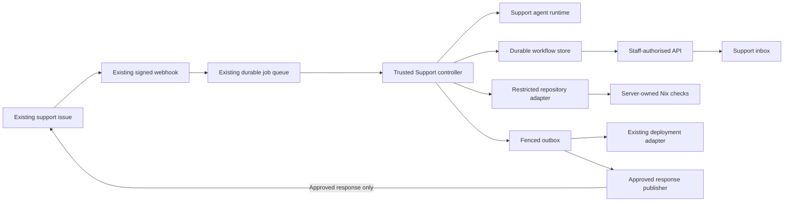

# Support agent workflow

The support agent workflow is an additive, removable part of the existing Support system.
The customer issue remains the system of record. Agents work privately, and trusted Support
code owns state, policy, approvals, repository access, Nix checks, deployment intents, and
customer publication.

The implementation is split deliberately:

- `packages/support-workflow/` owns the workflow contracts, controller, state machine, policy,
  ports, and curated staff view;
- `packages/support-agent-runtime/` is the small Support-owned agent process and its nine
  stage skills;
- `examples/workflow-demo/` provides the local inbox and review flow;
- each consuming application supplies its route, durable adapters, and server-owned Nix
  execution profile.

The agent runtime is not a general collaboration or infrastructure platform. It has no Slack
integration or Fly machinery, does not provision cloud machines or create repositories, and
does not decide how an application is deployed. A small amount of its turn lifecycle and
harness implementation was adapted from QM v0.1.4 under the MIT licence; see
[the provenance note](./third-party/qm-v0.1.4.md).

## Architecture



The controller never treats agent prose as authority. It validates structured artifacts,
checks optimistic workflow versions, binds approvals to the current issue and artifact,
enforces rollout ceilings, inspects trusted diffs, runs configured checks through the
repository adapter, and records every transition.

## Execution boundaries

Three separate boundaries are intentionally not collapsed into one generic "sandbox":

1. **Codex process sandbox:** every turn run by the current Codex harness, including turns
   with no repository context, uses the Codex CLI read-only process sandbox. It is always on
   and is not relaxed because a stage has no external workspace.
2. **Read-only repository context:** code-grounded investigation may receive an explicitly
   mapped existing application repository as additional read-only context. This is optional
   context for investigation only; it is not a repository clone, a writable checkout, or a
   prerequisite for general reasoning, security screening, validation, triage, or
   non-repository planning.
3. **Candidate and check sandbox:** implementation and QC will require a separate trusted
   repository adapter that creates an isolated writable candidate, exposes a fresh read-only
   view of the exact candidate to QC, and runs the server-owned Nix profile. That runner is
   future infrastructure and is not enabled by weakening the current Codex sandbox.

Without an external repository workspace, the runtime can still reason about the supplied
ticket, screen it, validate it, triage it, and form a non-code-grounded plan. Repository-backed
investigation is added only when checking the actual codebase would improve or substantiate
that plan.

| Work | Current Codex process sandbox | Repository or candidate context | Trusted Nix checks |
| --- | --- | --- | --- |
| Screening, reasoning, validation, and triage | Read-only, always on | None | None |
| Investigation and planning | Read-only, always on | Optional existing repository, read-only | None |
| Implementation | Not enabled in the local Codex lane | Future isolated writable candidate | Required after candidate creation |
| QC | Not enabled in the local Codex lane | Future fresh read-only view of the exact candidate | Required; observed results replace model claims |
| Staging/production verification, deploy-intent review, and response drafting | Read-only, always on | None | None |

## Staff experience and privacy

The staff application follows a progressive inbox flow:

1. See applications with ticket and review counts.
2. Open an application to see its support tickets.
3. Open a ticket to see the customer report and suggested fix.
4. Review the concise recommendation, changed paths, restrictions, and trusted check results.
5. Expand agent activity or raw diagnostics only when more detail is useful.
6. Approve the current gate or reject it with a reason.

| Surface | Contents | Audience |
| --- | --- | --- |
| Customer issue | Customer messages and, eventually, one approved response | Existing issue viewers |
| Support ticket detail | Suggested fix, curated evidence, paths, checks, restrictions, decisions | Authorised staff |
| Agent activity | Stage status and safe internal evidence | Authorised staff |
| Candidate workspace | Proposed diff for a production adapter's immutable input | Engineering reviewers through the trusted adapter |

Raw prompts, hidden reasoning, credentials, full process transcripts, private environment
URLs, and unrestricted logs are not part of the browser model. Agent activity is not written
to a GitHub issue comment. A customer response can be published only by the separate,
idempotent publisher after its explicit human gate.

## Workflow and human gates

1. **Intake:** the existing webhook verifies the signature and schema, then durably enqueues
   the normalised event.
2. **Validation agent:** checks completeness, reproduction detail, sensitive content,
   injection attempts, duplicates, and security signals. It cannot inspect or change code.
3. **Triage agent:** proposes priority, component, route, risk, and confidence. P0 and security
   signals stop for a human.
4. **Investigation agent:** can reason and plan without external repository context; when a
   code-grounded plan is needed, the trusted adapter supplies a read-only checkout at the exact
   base SHA so it can propose specific files and checks that match established patterns.
5. **Human plan gate:** implementation cannot begin until the current issue snapshot and plan
   artifact are approved. Restricted work remains proposal-only.
6. **Implementation agent:** once a production adapter enables this future capability, works
   only in an isolated writable candidate on allowed source and test paths, against the
   approved plan. The current local Codex lane does not run this stage.
7. **Trusted Nix checks:** the repository adapter runs the application route's exact Nix
   profile. Observed results replace any test claim made by the model.
8. **Independent QC agent:** once candidate execution is enabled, reviews the exact candidate
   SHA and complete trusted diff through a fresh read-only candidate view. Failed QC loops
   return to a human rather than continuing indefinitely.
9. **Human code gate:** a reviewer requests changes or records the reviewed immutable result.
10. **Staging verification:** non-destructive checks confirm the reviewed SHA and original
    scenario in the configured staging environment.
11. **Human deployment gate:** approval is bound to the exact SHA, environment, adapter, and
    current workflow version.
12. **Deployment intent and trusted adapter:** the agent may validate the bounded intent, but
    only the controller can enqueue an adapter call. The agent receives no deployment
    credential or general shell.
13. **Production verification:** read-only checks confirm the deployed SHA, health, and
    original scenario.
14. **Response draft and human response gate:** the agent drafts a customer-safe response from
    verified evidence. Publication is a separate approved outbox action.

New issue content invalidates ordinary in-flight work and approvals. Agent-stage retries reuse
the same persisted idempotency key. Malformed output, unsafe input, missing evidence, timeouts,
unexpected SHAs, stale decisions, and ambiguous receipts fail closed.

## Rollout ceilings

Every application route has a server-owned automation mode. The state machine enforces the
ceiling even if an agent asks to continue.

| Mode | Maximum behaviour | External effect |
| --- | --- | --- |
| `shadow` | Validate and triage | None |
| `plan` | Investigate and show a proposed fix | None |
| `code` | Create an isolated candidate and run QC | Local candidate only |
| `release` | Continue through approved deployment and verification | Deployment through an existing adapter only |
| `full` | Complete an approved customer response | One idempotent approved response |

Start each application in `shadow`, then advance it only after the evidence quality, routing,
false-positive rate, Nix profile, and staff experience are acceptable. Removing its route or
dropping it back to `shadow` leaves ordinary support handling in place.

## Server-owned Nix execution profiles

The production adapter contract requires target applications to run their checks through Nix.
The model does not inspect the host and guess how to install or test an application. Instead,
the server registers one validated profile with the application's support route.

```json
{
  "kind": "nix-dev-shell",
  "profileId": "ama-support-v1",
  "flakeSubdir": ".",
  "workspaceSubdir": ".",
  "devShell": "support",
  "timeoutMs": 600000,
  "checks": [
    {
      "id": "check",
      "label": "Static checks",
      "argv": ["bun", "run", "check"]
    },
    {
      "id": "tests",
      "label": "Unit tests",
      "argv": ["bun", "run", "test"]
    }
  ]
}
```

The profile contains:

- a stable ID so a review shows exactly which policy was used;
- repository-relative flake and workspace directories;
- an explicit named, non-default development shell;
- one bounded timeout;
- labelled checks represented as argument arrays rather than model-generated shell text.

The trusted repository adapter receives this object and is responsible for entering the exact
flake and named dev shell before executing each argument array. It must not fall back to a
host-global Bun, infer another shell, install dependencies outside Nix, or substitute a model
command. Results are normalised to `passed`, `failed`, or `not_run` with a concise summary and
bounded internal log reference.

That runner is deliberately not connected in this local prototype. Live Codex stops after the
read-only plan; the mock lane supplies deterministic fake receipts so the UI and gates can be
tested without implying that Nix executed. A consuming application's isolated repository
adapter must implement and validate this contract before `code` mode can be enabled.

The ticket view should show friendly evidence such as “Nix environment ready”, “Static checks
passed”, and “Unit tests failed”. Exact arguments and bounded logs belong in expandable agent
activity, not at the top of the ticket.

A missing shell, evaluation failure, timeout, unknown check ID, duplicate result, or omitted
required result stops the stage. It never becomes a successful check because the agent said it
passed.

## Repository safety policy

The application route supplies the existing repository identity, base branch, allowed and
forbidden paths, Nix profile, environments, and adapter IDs. It does not authorise creating a
new repository or changing repository settings.

Trusted diff policy converts the work to an R3 proposal when it detects:

- database schemas, migrations, database operations, or application data changes;
- dependency manifests, lockfiles, or dependency additions;
- Nix files, `flake.nix`, `flake.lock`, `.envrc`, `.direnv`, or other environment control files;
- CI, infrastructure, authentication, authorisation, secrets, releases, or generated output;
- any forbidden or non-allowlisted path;
- suspicious patch metadata that contradicts the agent's changed-path list.

These files may be named in a separate proposal with risk and rollback considerations. The
support agent cannot apply them as part of a ticket fix.

Repository access is a capability of the trusted adapter, not of the agent runtime. Production
read-only stages must receive an immutable checkout, and implementation must receive a
disposable candidate workspace only after approval. Draft review publication, if a consuming
application ever enables it, is a separate narrow capability; merge, release, repository
creation, settings, and force-push authority are never inferred.

## Local development

From the repository root:

```sh
bun run dev
```

Open <http://127.0.0.1:4174>. The launcher starts the Support agent runtime and staff app under
Bun. `SUPPORT_AGENT_PORT` changes the runtime port, and `SUPPORT_WORKFLOW_DEMO_PORT` changes the
staff app port.

The default harness is `mock`. It is deterministic, makes no model request, and uses record-only
external adapters while still exercising the runtime request, asynchronous run lifecycle,
controller, and human gates.

For Codex mode, copy the tracked root `.env.example` to the ignored root `.env` and set:

```dotenv
SUPPORT_AGENT_HARNESS=codex
OPENAI_API_KEY=your-local-key
```

`SUPPORT_AGENT_CODEX_BIN` optionally selects a specific executable. The launcher otherwise
uses the pinned local installation. Shell variables take precedence over root `.env` for a
one-off run. The API key is passed only to the agent process and is never exposed to the staff
browser.

`SUPPORT_AGENT_WORKSPACE_ROOT` optionally points at the directory containing existing
application repositories. It defaults to Support's parent directory. An explicit full-slug
mapping resolves `xgx-ai/ama-app` to the existing `ama-app/` sibling; unknown repositories are
rejected. This context is used only for repository-backed investigation. Reasoning, security
screening, validation, triage, and non-repository planning do not need it. The local adapter
verifies the Git top-level and records the current HEAD, reads the existing working tree
read-only, including any local uncommitted content, and never clones, creates, commits,
branches, or pushes a repository. This local convenience is not the immutable checkout
required by a production adapter.

Starting `bun run dev` does not itself make a model request. The live ticket opens in its
intake state; **Run agents** explicitly starts validation, triage, and read-only investigation.
The default mock harness still prepares its deterministic review fixture automatically.

The Codex CLI read-only process sandbox is always active in Codex mode, whether or not an
investigation repository is supplied. Implementation and QC need a separate trusted candidate
and Nix runner; they are not enabled by relaxing that process sandbox. Starting the runtime
under Bun does not grant repository, database, deployment, or publication authority.

Useful commands:

```sh
bun run dev:agent
bun run dev:ui
bun run demo:workflow --scenario=happy
```

The fastest repository checks should also be run from this repository's Nix shell:

```sh
nix develop --command bun run check
nix develop --command bun run test
```

These commands validate the Support repository itself: its runtime, workflow, UI, and tests.
They do not execute an application's registered Nix profile and do not validate a support
ticket candidate. Candidate evidence can come only from the future trusted repository adapter
running the exact server-owned profile against the isolated candidate.

## Production integration

The consuming backend composes the workflow at its existing boundaries:

1. Keep the signed support webhook and enqueue normalised events through the existing durable
   job system. Never wait for an agent in the webhook request.
2. Implement `WorkflowStore` with the existing durable database and atomic optimistic
   transactions for workflows, approvals, feedback, artifacts, activity, and outbox records.
3. Register one server-owned route and Nix profile per application, starting in `shadow`.
4. Implement `RepositoryPort` with immutable read checkouts, disposable candidate workspaces,
   trusted full-diff inspection, exact SHA binding, and Nix profile execution.
5. Run the Support agent runtime privately and pass only stage-scoped context and workspace
   capabilities. Writable stages remain disabled until isolation is proven.
6. Map deployment adapter IDs to existing application-owned release mechanisms. Ignore any
   command or environment proposed by the model.
7. Publish responses through the existing GitHub App client with an idempotency key that
   returns the original comment on retry.
8. Mount the curated staff API behind genuine staff/admin authorisation and apply existing
   role checks to every action.
9. Run workers outside request handlers and preserve retry, lease, outbox, and reconciliation
   semantics across process restarts.

No production adapter should be connected until its owner, authentication boundary,
idempotency behaviour, timeout, audit trail, and rollback path are explicit.

## Local removal and rollback

The workflow is inert unless a consuming backend registers a route and worker. To disable it,
remove that registration or return no route for the application, then stop the local runtime.
The existing support issue flow continues unchanged.

Because the agent runtime, workflow package, and demo are separate from the existing support
client, the local experiment can be removed without migrating customer issues or replacing the
current support infrastructure.
