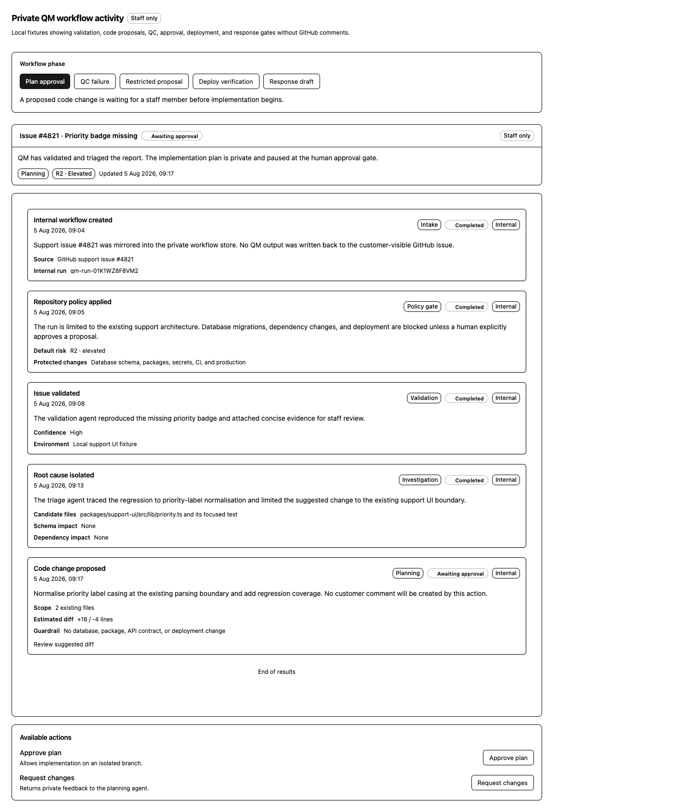

# Staff workflow demo

This local-only Solid application renders `AgentActivityPanel` with both a live
in-memory workflow and fixed review fixtures. The live view calls a Bun API host
which composes the real support controller with the editable QM source. GitHub,
deployments, databases, and public responses remain record-only.

From the repository root, start QM and the app together:

```sh
bun run dev
```

Open [http://127.0.0.1:4174](http://127.0.0.1:4174). To use another local port,
set `SUPPORT_WORKFLOW_DEMO_PORT`; set `SUPPORT_QM_PORT` to move the QM core. The
launcher installs any missing locked dependencies on its first run.

The default `SUPPORT_QM_HARNESS=mock` mode runs the real vendored QM HTTP server,
HMAC source authentication, fail-closed input screening, deployment skills, and
async worker under Bun. Its stage artifacts are deterministic, so it needs no
model key or Docker and cannot change a repository. Use the scenario buttons to
exercise the happy path, shadow mode, answer-only routing, restricted proposal,
P0 escalation, repeated QC failure, and stale-input handling.

Real model mode is an explicit opt-in:

```sh
SUPPORT_QM_HARNESS=codex bun run dev
```

The launcher reads `OPENAI_API_KEY` from the gitignored `infra/qm/.env`; an
explicit shell environment variable still takes precedence. You can also put
`SUPPORT_QM_HARNESS=codex` in that file so the shorter `bun run dev` command uses
Codex on every local run.

Live mode is capped at planning in this local host. Repository-reading or
code-writing stages additionally require a sandbox-aware repository adapter and
QM's isolated Docker or Sprites sandbox; the Bun core does not make it safe to
run an agent directly against the host checkout.

To run only one side while diagnosing startup:

```sh
bun run dev:qm
bun run dev:ui
```

`dev:ui` intentionally falls back to the in-process scripted runtime when no QM
URL and signing secret are supplied. The page labels that mode explicitly.

To produce the static build without starting the local server:

```sh
bun run --cwd examples/workflow-demo build
```

The live action buttons exercise optimistic versions and every human gate. The
fixed phase buttons continue to cover focused review states. Both views
distinguish private activity from `public_candidate` output; nothing becomes a
GitHub comment until a separately authorised production publisher is connected.


